# GitHub Portfolio App
The screening process for reviewing a prospective employee can be long and arduous. This project aims to simplify the process of reviewing GitHub Portfolios and also looking at current and emerging tredns when it comes to the latest repositories. This project was built using React, Nextjs and ShadCn. It freely available at the following site:  
https://react-assessment-mihir.vercel.app

---

## Table of Contents

- [Installation](#installation)  
- [App Overview](#app-overview)
- [Lighthouse Performance](#lighthouse-performance)

---

## Installation
In order to set up and run the project on your local device, make use of the following commands in your terminal:

1. Clone the repository:

```bash
git clone https://github.com/Graduate-Program-26/React-Assessment-Mihir.git
```

2. Install dependencies using:
```bash
pnpm install
```

3. Start the development server by running:
```bash 
pnpm run dev
```

4. In your terminal you will see a message telling you at which URL you may access the application. The below is an example:
```bash
> github-dashboard@0.1.0 dev
> next dev

▲ Next.js 16.1.7 (Turbopack)
- Local:         http://localhost:3000
- Network:       http://192.168.1.25:3000
- Environments: .env
```

5. Environment Variables
In order to run the above successfully, you will have to generate your own environment variables:
- ``AUTH_SECRET``: used for Auth js and can be acquired by running npx auth secret
- ``AUTH_GITHUB_ID``: credential provided once you have registered your app for GitHub OAuth
- ``AUTH_GITHUB_SECRET``: credential provided once you have registered your app for GitHub OAuth
- ``GITHUB_TOKEN``: this is your personal GitHub access token which can be found in your profile settings

Note: You may use your preferred package manager. NPM was used as an example.

## App Overview
### Landing Page
When you first open the website you will be greeted by the following landing page:

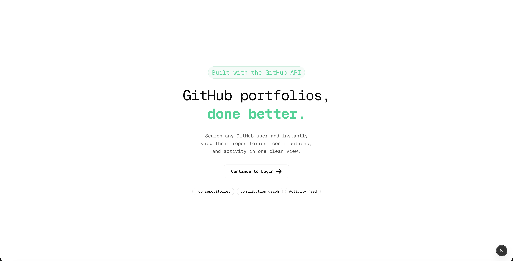

If you continue to login you will be brought to the following screen where you can log in with your GitHub credentials:

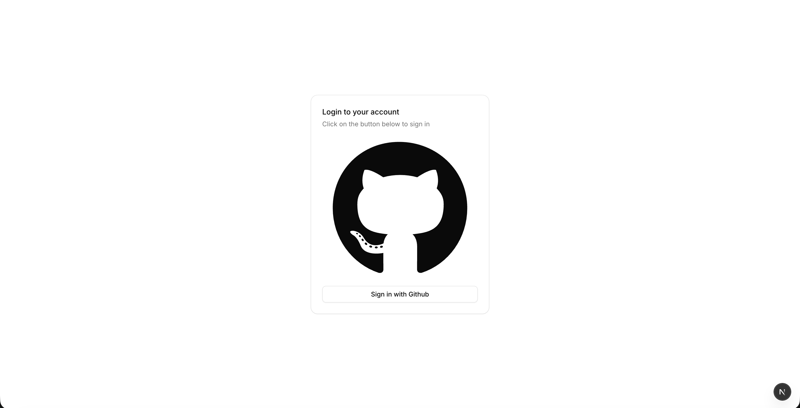

### Main Content

Once signed in you will see the following:

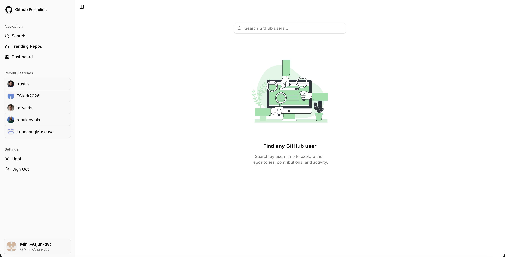

As you can see above, there is a navigation bar to the side with options for a search page, trending page, dashboard page, recent searches and settings which include theme toggling and signing out. 

### Search Page
If you type a name into the search bar at the top of the page you will see a grid of potential profiles that you can interact with:

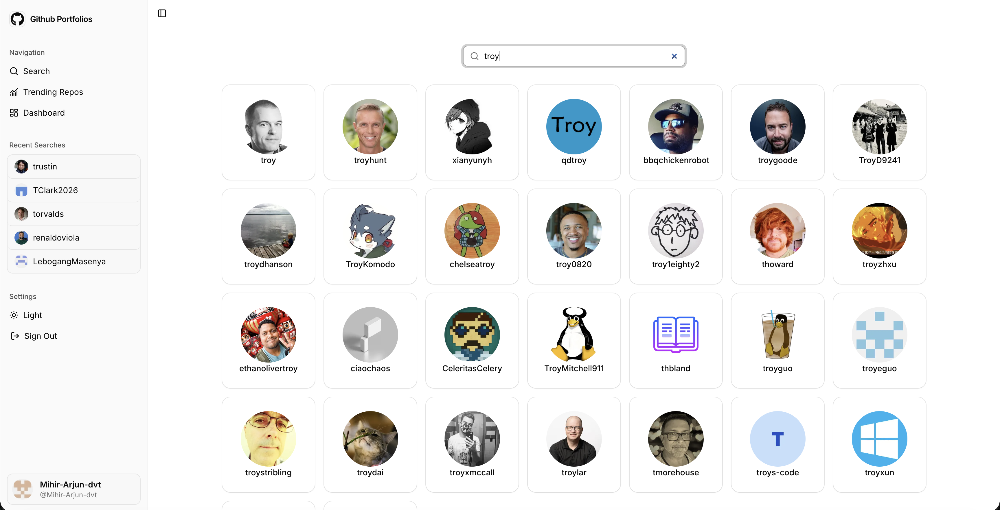

### Profile Page
If a profile is selected above then you will be brought to a page that looks like the one below:

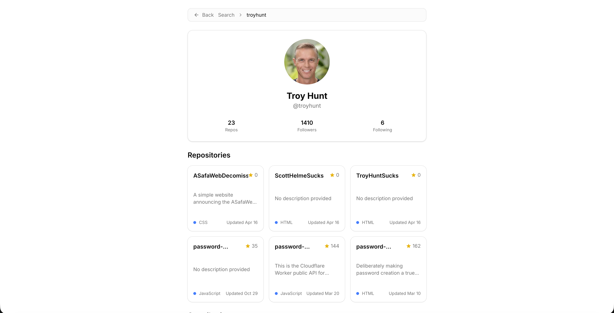
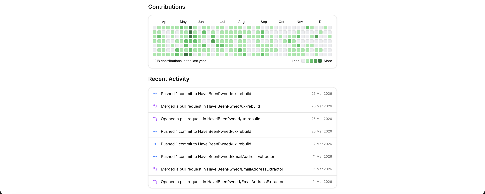

As you can see above the profile page contains more information about the user such as the number of public repositories, followers and following. Below that you can see the users top 6 repositories, contribution chart and their 10 most recent public activities.

### Trending Repositories
On the Trending Repositories page you can see which repositories are trending within the last month, week or even day. You can also filter by language and see insights on the direction that new projects are heading in:

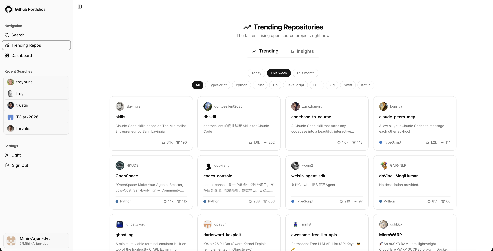

Below you can see the insights page which visualise what is popular right now with visualisations such as a pie chart, bar graph and word clouds.

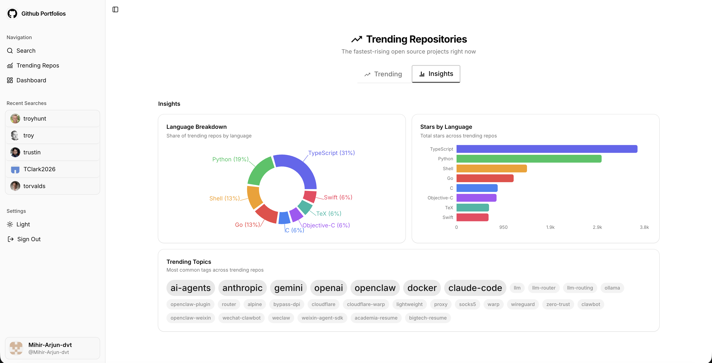

### Dashboard Page
The dashboard page is very similar to the normal profile page except that it specifically shows the logged in user's profile as seen below:

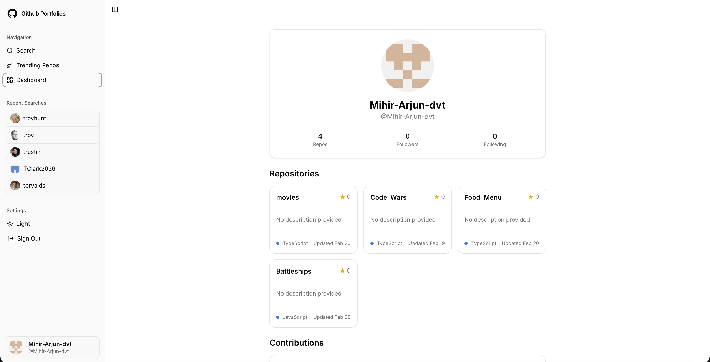

### Dark Mode
My project also includes support for dark mode and themes can even be set to your system settings if that is your preference. Below you can see an example of what this would look like:

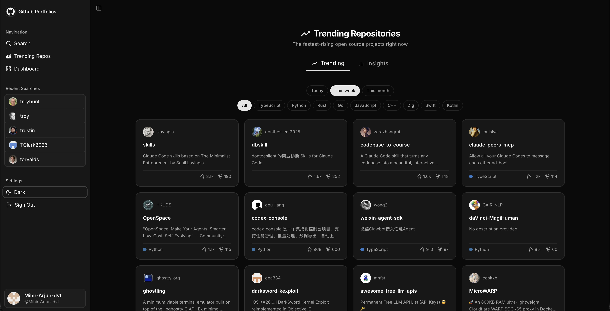

### Mobile Responsiveness
This application has been designed with mobile responsiveness in mind and this can be seen below:

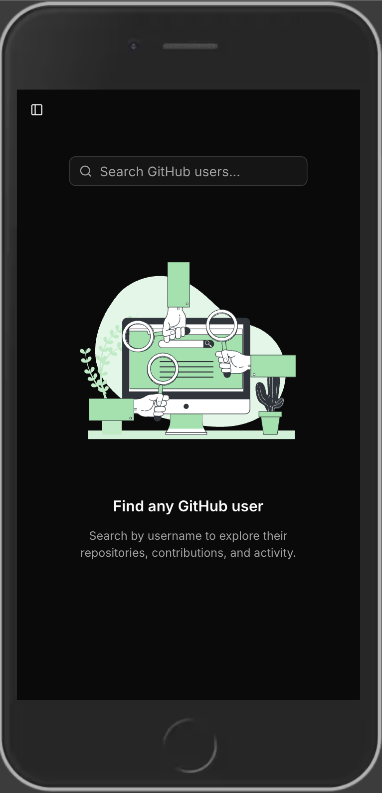
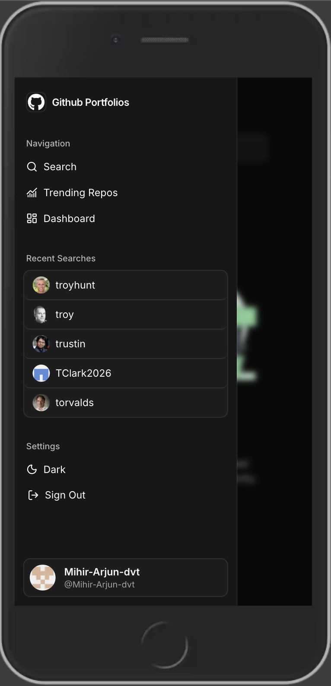
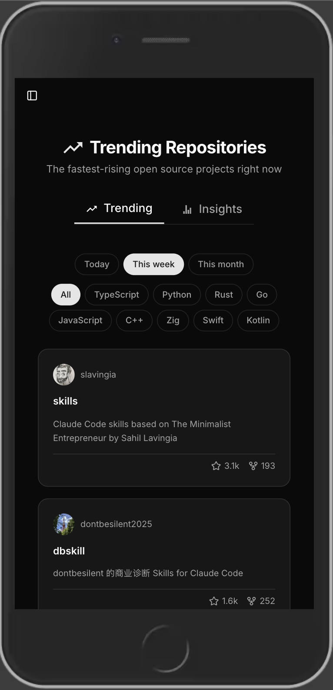
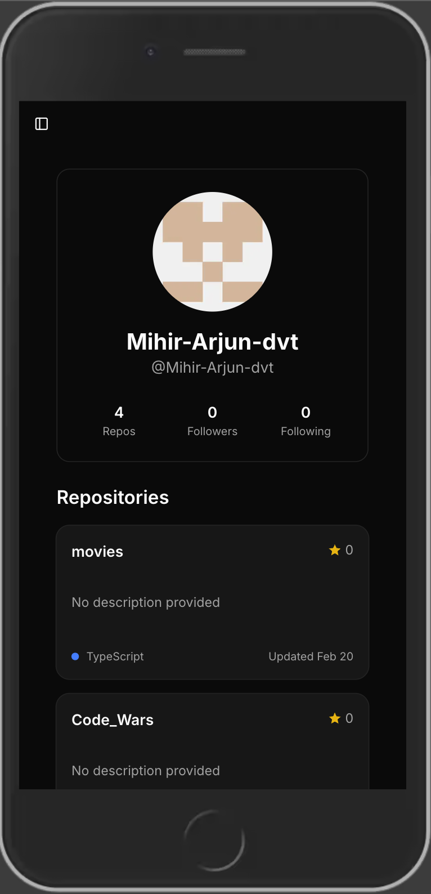

## Lighthouse Performance
Below you can see the lighthouse performance scores. The overall performance is excellent with a score of 97. It was a technical constraint to achieve 100% accessibility which can be seen below:

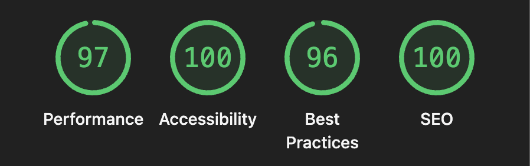

## Conclusion
This concludes the readme of my application but just remember that you can view it for free at the following URL and test it out for yourself:  
https://react-assessment-mihir.vercel.app